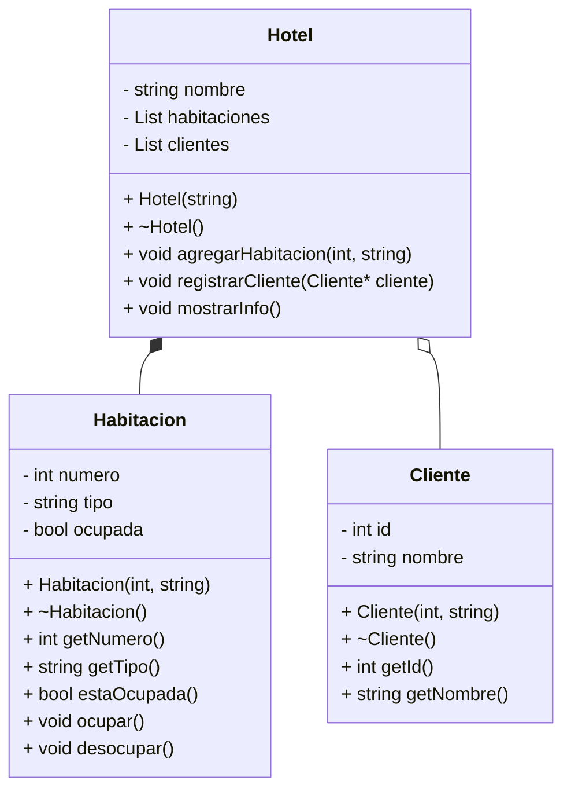
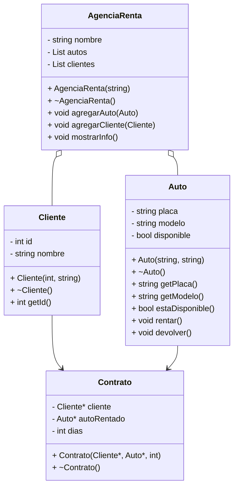

# diagramasUML

```mermaid
classDiagram
	
	class Habitacion {
	    - int numero
	    - string tipo
	    - bool ocupada
	    + Habitacion(int, string)
	    + ~Habitacion()
	    + int getNumero()
	    + string getTipo()
	    + bool estaOcupada()
	    + void ocupar()
	    + void desocupar()
	}

	class Cliente {
	    - int id
	    - string nombre
	    + Cliente(int, string)
	    + ~Cliente()
	    + int getId()
	    + string getNombre()
	}

	class Hotel {
	    - string nombre
	    - List<Habitacion> habitaciones
	    - List<Cliente> clientes
	    + Hotel(string)
	    + ~Hotel()
	    + void agregarHabitacion(int, string)
	    + void registrarCliente(Cliente* cliente)
	    + void mostrarInfo()
	}

	Hotel *-- Habitacion
	Hotel o-- Cliente

```	

```mermaid
classDiagram
	
	class Auto {
		- string placa
		- string modelo
		- bool disponible
		+ Auto(string, string)
		+ ~Auto()
		+ string getPlaca()
		+ string getModelo()
		+ bool estaDisponible()
		+ void rentar()
		+ void devolver()
	}
	
	class Cliente {
		- int id
		- string nombre
		+ Cliente(int, string)
		+ ~Cliente()
		+ int getId()
	}

	class Contrato {
		- Cliente* cliente
		- Auto* autoRentado
		- int dias
		+ Contrato(Cliente*, Auto*, int)
		+ ~Contrato()
	}

	class AgenciaRenta {
		- string nombre
		- List<Auto> autos
		- List<Cliente> clientes
		+ AgenciaRenta(string)
		+ ~AgenciaRenta()
		+ void agregarAuto(Auto)
		+ void agregarCliente(Cliente)
		+ void mostrarInfo()
	}

	Cliente --> Contrato
	Auto --> Contrato
 	AgenciaRenta o-- Auto 
	AgenciaRenta o-- Cliente 


```
